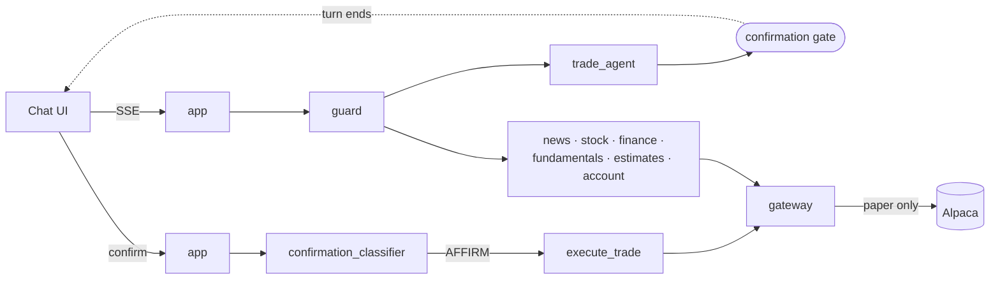

# tradepilot

> A conversational AI trading assistant. Ask questions in natural English
> about US stocks — news, fundamentals, estimates, your portfolio — and
> place **paper** orders with human-in-the-loop confirmation.


> ⚠ **tradepilot only connects to Alpaca's paper-trading endpoint. Live
> trading is architecturally blocked, not just disabled.**

## What it does

Chat in English about US equities. tradepilot has seven specialist agents
(news, stock, finance, fundamentals, estimates, account, trade) routed by a
topic guard. Trading is paper-only, gated behind a two-turn confirmation
with an HMAC-signed draft and a 60-second TTL.

## Quickstart

```bash
git clone https://github.com/anthropics/tradepilot.git
cd tradepilot
cp .env.example .env
# set ALPACA_API_KEY_ID, ALPACA_API_SECRET_KEY, ANTHROPIC_API_KEY in .env
docker compose -f docker-compose.minimal.yml up --build
curl localhost:4700/health    # {"status":"ok","trading_mode":"paper"}
```

Full stack (includes the Streamlit chat UI on `:4705`):

```bash
docker compose up --build
```

## Architecture



## The confirmation gate

Placing a paper order is **always** two turns:

1. User says "buy 10 TSLA". The trade agent calls `prepare_order`, which
   validates the symbol, checks buying power, and returns an `OrderDraft`
   signed with HMAC-SHA256 and a 60-second TTL. The turn ends with a
   `trade_intent` block rendered in the UI.
2. User replies "confirm". The classifier verifies AFFIRM. `execute_trade`
   re-verifies the token and TTL, then calls the gateway's paper endpoint.

Tampering invalidates the signature; elapsed time invalidates the TTL. The
LLM cannot skip this gate — it's a graph edge, not a prompt instruction.

## Features

- **LangGraph** orchestration with Postgres or in-memory checkpointing.
- **LiteLLM** proxy for routing between Claude and GPT.
- **Langfuse** tracing with `mode=paper` metadata on every trading event.
- **Pluggable providers**: Alpaca primary, Finnhub + Alpha Vantage fallbacks.
- **Typed response blocks** (discriminated union) — `quote`, `chart`,
  `news_card`, `trade_intent`, `order_result`, `account_summary`, etc.
- **Validator** auto-scrubs PII, injects disclaimers, and enforces
  paper-mode on every trading block.
- **Evals framework** with YAML datasets for each agent category.

## Safety: five independent layers

1. Config gate: refuses to boot unless `ALPACA_PAPER_ONLY=true`.
2. Constructor: `TradingClient(paper=True)` — no config can override.
3. `_assert_paper()`: base-URL check before every I/O. Live URL hardcoded to
   a denylist constant.
4. Startup verification: calls `/v2/account`, asserts `mode=paper`. Failure
   exits uvicorn.
5. Schema + validator: every trading block carries `mode: Literal["paper"]`
   non-optionally. Missing / wrong flag → block dropped.

See [docs/overview/safety.md](docs/overview/safety.md).

## Contribute / extend

- Add an agent → [docs/development/adding-an-agent.md](docs/development/adding-an-agent.md)
- Add a tool → [docs/development/adding-a-tool.md](docs/development/adding-a-tool.md)
- Add a provider → [docs/architecture/provider-abstraction.md](docs/architecture/provider-abstraction.md)
- Filing issues and PRs → [CONTRIBUTING.md](CONTRIBUTING.md)

## License

[Apache 2.0](LICENSE).
