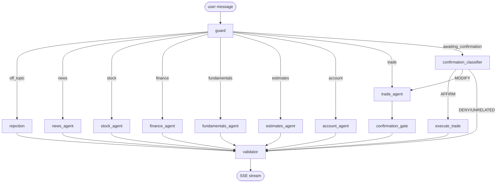

# Agent graph

## Nodes

| Node | Role |
|---|---|
| `guard` | Topic classification + ticker extraction. Routes to agent or rejection. |
| `router` | Deterministic category → node map (used as the conditional edge body). |
| `rejection` | Emits a polite off-topic text block. No LLM call. |
| `news_agent` | ReAct agent bound to news tools. Emits `news_card` blocks. |
| `stock_agent` | Quotes, charts, price history. Emits `quote` / `chart` blocks. |
| `finance_agent` | Conceptual Q&A. Pure LLM, no tools. Text blocks. |
| `fundamentals_agent` | Ratios, statements, filings, segments. Table blocks. |
| `estimates_agent` | Earnings estimates, recommendations, price targets. |
| `account_agent` | Account summary + positions table. |
| `trade_agent` | Extracts order args, calls `prepare_order`, emits `trade_intent`. |
| `confirmation_classifier` | AFFIRM / DENY / MODIFY / UNRELATED. Cheap model. |
| `confirmation_gate` | Load-bearing no-op: pauses graph when `awaiting_confirmation`. |
| `execute_trade` | Re-verifies HMAC token and TTL, places order, emits `order_result`. |
| `validator` | PII strip, disclaimer inject, paper-mode enforcement. |
