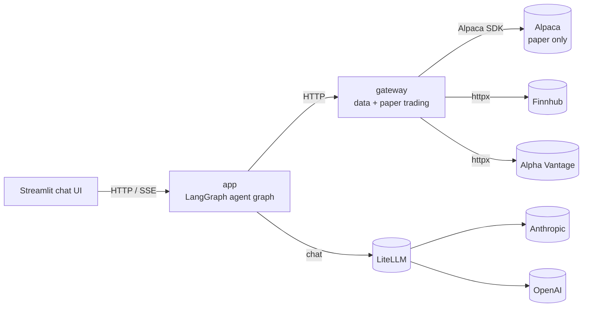

# System overview

Two FastAPI services:

## app (`src/`)

Hosts the LangGraph agent graph. One FastAPI app with three route groups:

- `/health`
- `/chat` (SSE)
- `/conversations`

The graph has 13 nodes: guard, router, 7 specialist agents, trade agent,
confirmation classifier, confirmation gate, execute-trade, and validator.
See [Agent graph](agent-graph.md).

## gateway (`gateway/`)

Every external call — market data and paper trading — goes through here.
Market-data providers sit behind a `DataProvider` ABC with a fallback chain
(Alpaca → Finnhub → Alpha Vantage). Paper trading sits behind a
`PaperTradingService` Protocol with Alpaca as the sole adapter.
See [Provider abstraction](provider-abstraction.md) and
[Paper-trading safety](paper-trading-safety.md).
